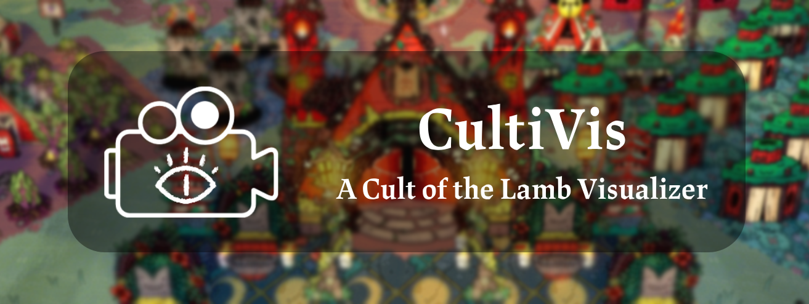
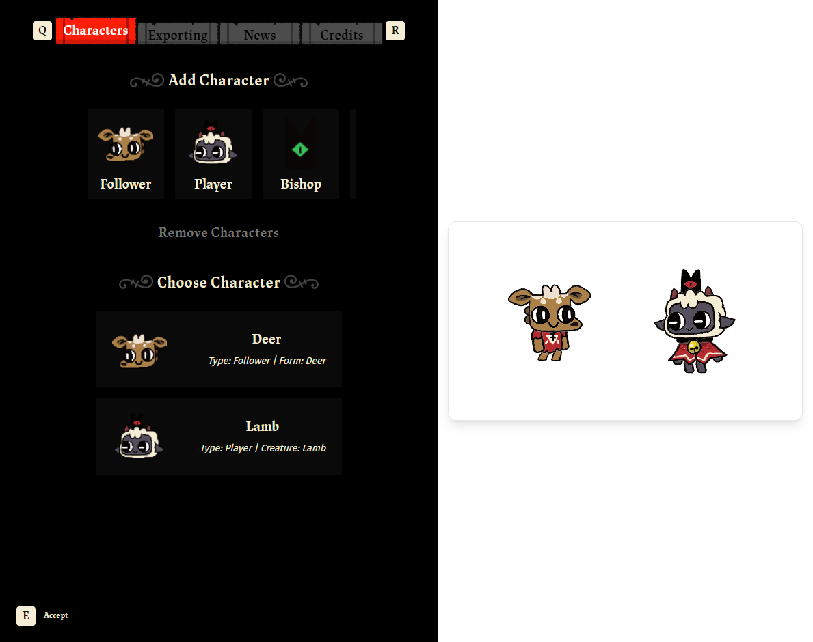
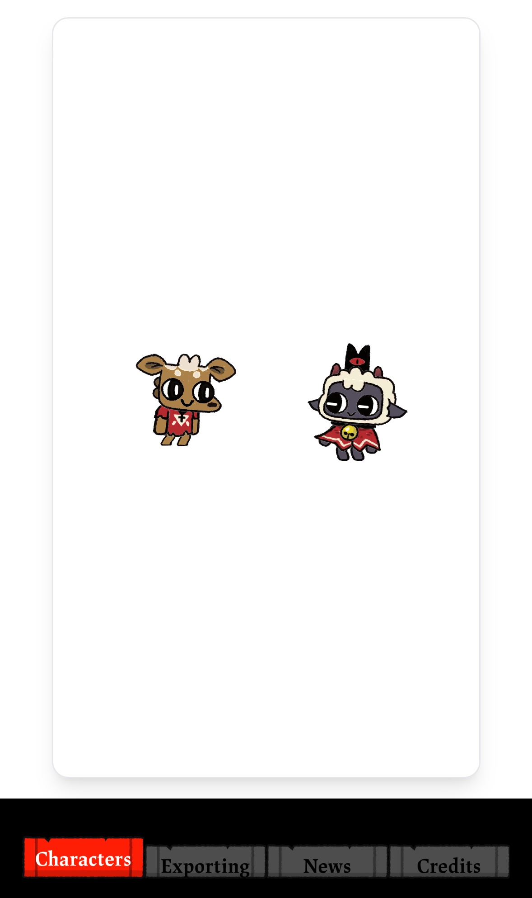
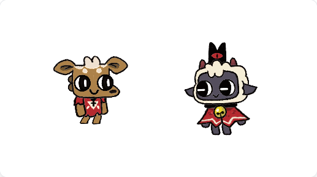
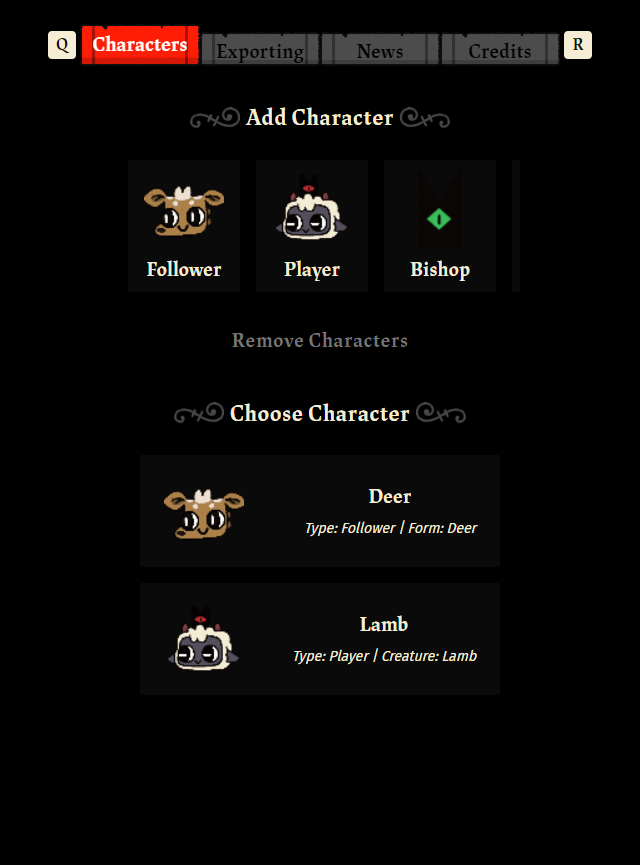
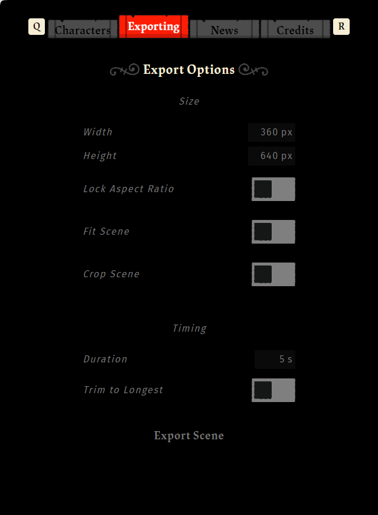
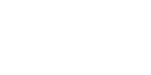
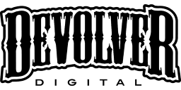

# CultiVis

A Cult of the Lamb visualizer

> [!WARNING]
>
> ## DISCLAIMER
>
> This project is not affiliated with [Massive Monster Games](https://massivemonster.co/) and [Devolver Digital Inc.](https://devolverdigital.com/) By using the software provided by this project, you agree to the [Terms of Service](ToS.md) of this project.

## Description

Cultivis is a fan-made project aimed to provide a simple yet intuitive visualizer for [Cult of the Lamb](https://cultofthelamb.com/). Currently, you can only view and export animations, but more exciting features will emerge as this project is being developed.

This project is inspired and is a continuation of [pocams](https://github.com/pocams)’ [cotlgif](https://github.com/pocams/cotlgif) project, which was discontinued in 2022.

## Usage

### Prelude

There is a disclaimer popup when you first visit CultiVis, which informs you on what you can and cannot use or do with CultiVis. See the [CultiVis Terms of Service](ToS.md) for more information.

### Interface

On a desktop, you will see a customization menu of how you can modify the characters and scene on the left-hand side of your screen. This is where you can click On the right-hand side, you should see two characters bobbing about.

If you are on mobile, you will see that the scene is sized vertically and almost fills up the entire screen. To customize and modify the scene and characters, scroll down and you should see a few actions which you can perform.

### Scene

The scene is where all your characters live and play their animations. You can move and scale them to fit how you want them to be displayed. It also serves as a preview of what you can expect to see when you export the scene.

#### Manipulating the Scene

You can move the scene by dragging your mouse around on the scene and releasing it at your desired location. You can also scroll with your mouse wheel to move the scene vertically, and holding <kbd>Shift</kbd> and scroll to move horizontally.

To scale up or down the scene, you can pinch the screen or scroll while pressing <kbd>Ctrl</kbd> on your keyboard.

### Characters

On the characters tab, you will see different types of characters that you can add to the scene. Pressing any of the buttons will create the selected character at the center of the scene.

At the bottom is a list of characters that you have added to the scene, clicking one of the buttons will focus the character and allow you to move or size the character in the scene like how you do when [manipulating the scene](#manipulating-the-scene).

Above that list is a button to remove characters, clicking it will give you the option to delete multiple characters at once without having to individually select and remove them one by one.

There is also a button to clone characters, which will likewise copy and paste them into the scene without having to individually create the same characters one by one.

#### Customization

Customizing characters was made with the intention of being intuitive and easy to use. With this in mind, the customization menus are built to be similar to how you would customize a follower when indoctrinating one.

Each character has its own customizable attributes, forms and features it can take, so providing a guide for each of them would be too tedious. Instead, try and experiment with the customization and see what you like or dislike.

### Exporting

To export the scene into a viewable format, you can click the Exporting tab on the top -left hand corner and see the options below.

There are a few options you can modify to change how you want your exported animation to look like. The following options are listed below:

#### Sizing Options

| Options | Description | Type |
| ------- | ----------- | ---- |
| Width   | The horizontal length of the export | integer |
| Height  | The vertical length of the export | integer |
| Lock Aspect Ratio | Locks the width and height ratio of the scene | on/off |
| Fit Scene | Resizes and moves the characters while allowing all content to remain visible (Locks scene) | on/off |
| Crop Scene | Resizes the scene without leaving any blank space visible (Locks scene) | on/off |

#### Timing Options

| Options | Description | Type |
| ------- | ----------- | ---- |
| Duration | How long will the animation lasts | number |
| Trim to Longest | Set the duration of the animation to the character with the longest animation's duration | on/off |

There are also different formats that the exported animation can come in, the two formats and their respective changeable settings are listed below:

#### Format Options (.GIF)

| Options | Description | Type |
| ------- | ----------- | ---- |
| Delay Per Frame | How long should each frame last before it moves on to the next one/loops | number |
| Has Accurate Colors | Should the animation show more accurate colors (takes a longer time to export if enabled) | on/off |

#### Format Options (.APNG)

| Options | Description | Type |
| ------- | ----------- | ---- |
| Delay Per Frame | How long should each frame last before it moves on to the next one/loops | number |

Once you have selected all of your desired settings, you can then click the Export Scene button and wait for the animation to generate.

As soon as you click, a progress ring will appear below the button showing the export progress. Once finished, it will disappear and you will automatically download the animation into your folder.

If your animation is too big or long, it may take a while to finish, so please do be patient when exporting.

## Addition of New Content

I will add and update CultiVis with new content every time the game goes through a major update/when a noticeable change of content occurs. Keep in mind that this may take more than a few days to CultiVis to fully implement.

## Contact and Reporting

To contact or ask me about any enquires about CultiVis, you can DM me via Discord at [@osoclos](https://discord.com/users/1138108450073759784).

If you have a bug to report, you can either [create an issue](issues/new) on Github or send me information about the bug directly via Discord.

## Credits and Copyright

### Game Assets and Inspiration

*© 2024 Massive Monster Games*

*© 2024 Devolver Digital Inc.*

### Rendering

*© 2020 Esoteric Software*

### Audio Extraction

*© 2024 foobar2000*

*© 2023 FMOD Bank Tools*

## Development and Cloning

If you wish to contribute to this project, you must follow the guidelines highlighted in the [Code of Conduct](https://github.com/osoclos/cultivis?tab=coc-ov-file). To develop and add onto this project, you can create a pull request and give a short summary of what you have added to the project before submitting.

If you intend to clone this project and distribute it as a product of your own while following the [Open Source License](https://github.com/osoclos/cultivis?tab=MIT-1-ov-file), you must also purchase a [Spine Editor License](https://esotericsoftware.com/spine-purchase) unless the Spine Runtimes library code is completely removed.
